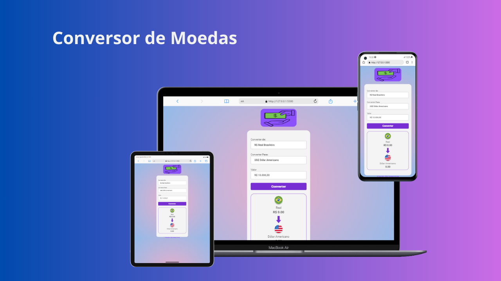

## Projeto Conversor de Moedas 💰

O projeto foi realizado no [DevClub](https://rodolfomori.com.br/devclub/) com o professor
[Rodolfo Mori](https://github.com/rodolfomori)

#### ✔️Sobre:

Este projeto foi criado com o objetivo de fornecer uma ferramenta simples e eficiente,
com uma interface intuitiva e amigável, os usuários podem selecionar as moedas de origem e de destino, inserir o valor a ser convertido e obter o resultado instantaneamente, o resultado já vem atualizado pelo servidor, pq usamos uma api.

#### 💻Tecnologias Utilizadas:

Usamos a API - AwesomeAPI - para trazer a cotação atualizada.

HTML - Utilizado para a estruturação do conteúdo da aplicação.

CSS - Utilizado para estilizar os elementos da aplicação e torná-la visualmente atraente.

JavaScript - Utilizado para adicionar interatividade à aplicação, como a lógica de conversão.

